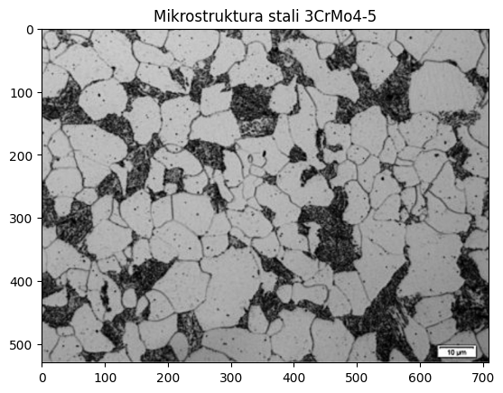
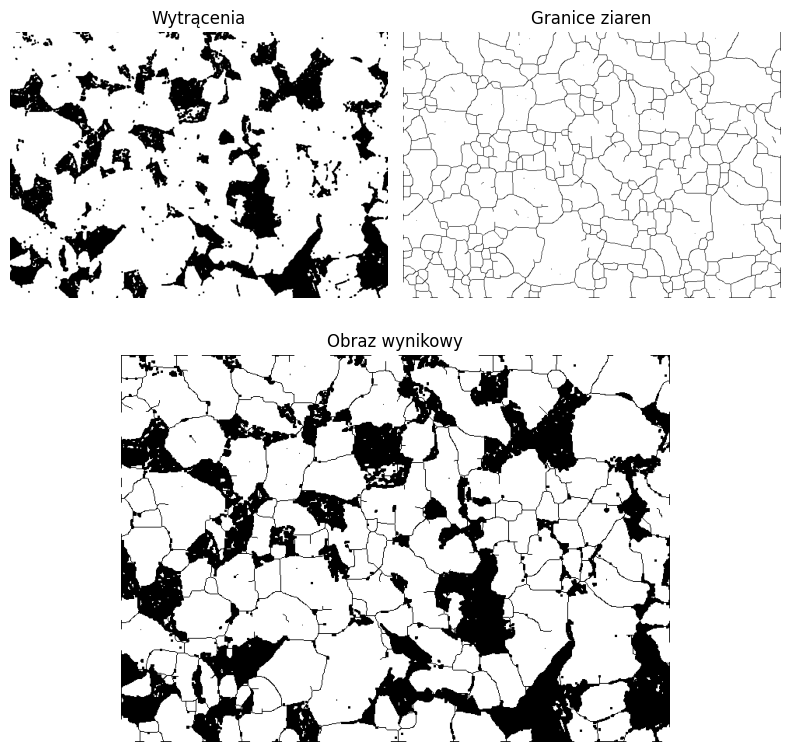

# Analysis of the microstructure of 3CrMo4-5 steel

Repository with a Python pipeline (NumPy, OpenCV, Matplotlib) for processing a microscopy image of a composite material. It includes data preparation, binarization, morphological operations, edge detection, and skeletonization. The project is reproducible in Jupyter/Colab.

## Original image

## Results

